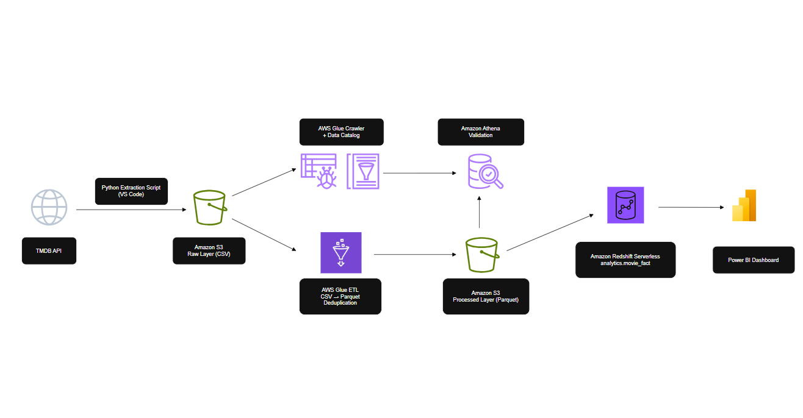

# TMDB Movie Analytics Data Pipeline

## Project Overview

This project demonstrates an end-to-end cloud-based data engineering pipeline built using AWS services and Power BI.

The pipeline extracts movie data from The Movie Database (TMDB) API, stores raw data in Amazon S3, performs transformations using AWS Glue, loads curated data into Amazon Redshift, and visualizes insights using Power BI.

The project showcases modern data engineering concepts including data lakes, ETL processing, schema discovery, cloud storage, data warehousing, and business intelligence reporting.

---

## Architecture

```text
TMDB API
    ↓
Python Extraction Script
    ↓
Amazon S3 (Raw Layer - CSV)
    ↓
AWS Glue Crawler + Data Catalog
    ↓
AWS Glue ETL
    ↓
Amazon S3 (Processed Layer - Parquet)
    ↓
Amazon Redshift Serverless
    ↓
Power BI Dashboard
```

### Architecture Diagram



---

## Technology Stack

| Category             | Technology                 |
| -------------------- | -------------------------- |
| Programming Language | Python                     |
| Source System        | TMDB API                   |
| Cloud Storage        | Amazon S3                  |
| Data Catalog         | AWS Glue Data Catalog      |
| ETL Processing       | AWS Glue                   |
| Query Engine         | Amazon Athena              |
| Data Warehouse       | Amazon Redshift Serverless |
| Visualization        | Power BI                   |
| Version Control      | Git                        |
| Repository           | GitHub                     |

---

## Data Pipeline Flow

### 1. Data Extraction

Movie data is extracted from the TMDB Popular Movies API using Python.

The extraction script:

* Retrieves multiple pages of movie data
* Handles API retries automatically
* Transforms JSON responses into tabular format
* Uploads data directly to Amazon S3
* Uses environment variables for configuration

### 2. Raw Data Layer

Raw movie data is stored in Amazon S3 in CSV format.

Location:

```text
s3://movie-tmdb-data-lake/raw/movies/
```

This layer preserves source data exactly as received from the API.

### 3. Data Catalog

AWS Glue Crawler scans the raw data and automatically detects:

* Columns
* Data types
* Schema information

The crawler populates the AWS Glue Data Catalog for downstream consumption.

### 4. ETL Processing

AWS Glue Visual ETL Job performs:

* Duplicate removal using movie_id
* Data quality checks
* CSV to Parquet conversion
* Curated dataset generation

Output location:

```text
s3://movie-tmdb-data-lake/processed/movies/
```

### 5. Data Warehouse

Curated Parquet files are loaded into Amazon Redshift Serverless using the COPY command.

Target table:

```sql
analytics.movie_fact
```

### 6. Reporting

Power BI connects directly to Amazon Redshift and provides business insights through interactive dashboards.

---

## Data Model

### analytics.movie_fact

| Column       | Data Type    |
| ------------ | ------------ |
| movie_id     | BIGINT       |
| title        | VARCHAR(500) |
| release_date | DATE         |
| popularity   | FLOAT        |
| vote_average | FLOAT        |
| vote_count   | BIGINT       |
| adult        | BOOLEAN      |
| language     | VARCHAR(20)  |

---

## Key Features

* End-to-end cloud data pipeline
* API-based data ingestion
* Direct S3 ingestion without local file dependency
* Automated schema discovery
* Data quality validation
* CSV to Parquet optimization
* Redshift data warehousing
* Power BI dashboarding
* Infrastructure documented through architecture diagrams

---

## Project Structure

```text
movie_tmdb_analytics_data_pipeline/
│
├── architecture/
│   └── tmdb_movie_pipeline_architecture.drawio
│
├── extraction/
│   └── extract_movies.py
│
├── screenshots/
│   ├── s3_raw_layer.png
│   ├── glue_crawler.png
│   ├── glue_schema.png
│   ├── athena_validation.png
│   └── powerbi_dashboard.png
│
├── sql/
│   ├── create_schema.sql
│   ├── create_movie_fact.sql
│   └── copy_movie_data.sql
│
├── requirements.txt
├── .gitignore
└── README.md
```

---

## Results

| Metric               | Value                      |
| -------------------- | -------------------------- |
| Movies Extracted     | 500                        |
| Duplicates Removed   | 4                          |
| Final Records Loaded | 496                        |
| Storage Optimization | CSV → Parquet              |
| Data Warehouse       | Amazon Redshift Serverless |

---

## Skills Demonstrated

* Python
* REST API Integration
* Amazon S3
* AWS Glue
* AWS Athena
* AWS Redshift
* Data Lake Architecture
* ETL Design
* Data Warehousing
* SQL
* Power BI
* Git
* GitHub

---

## Future Enhancements

* Apache Airflow orchestration
* Incremental data loading
* Automated scheduling
* Data quality monitoring
* CI/CD pipeline deployment
* Infrastructure as Code (Terraform)
* Multi-table dimensional modeling

---

## Author

Karthikeyan

Bachelor of Mechanical Engineering

Aspiring Data Engineer | AWS | Python | SQL | Power BI
